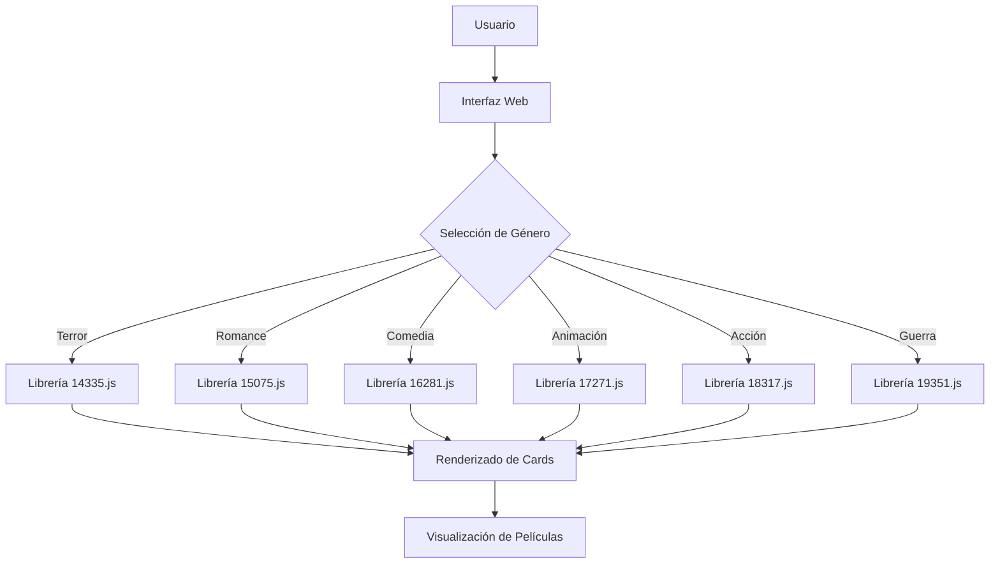
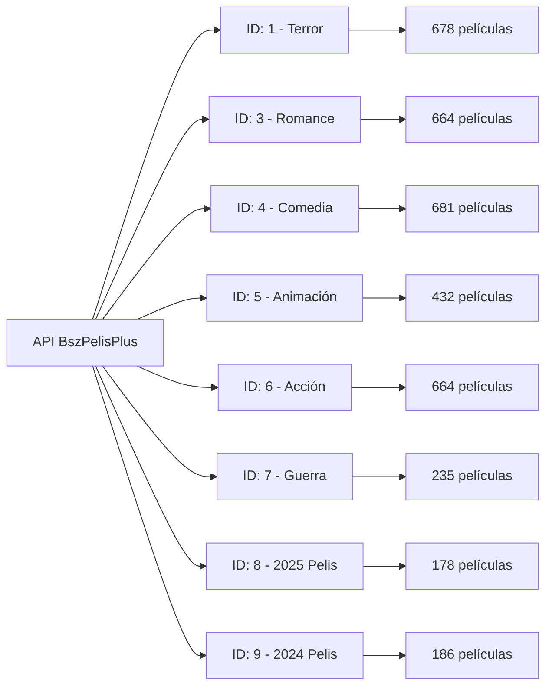
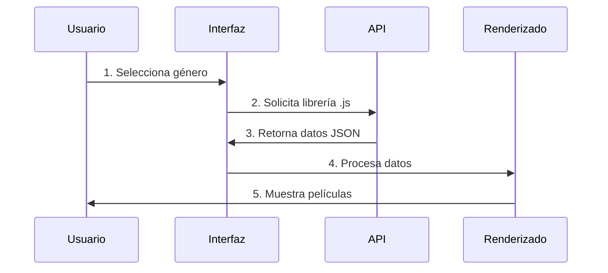
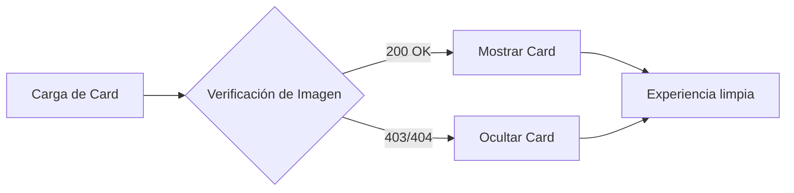

Aquí tienes el README.md profesional con gráficos conceptuales, diagramas y una estructura visual atractiva para tu proyecto:

---

# 🎬 BszPelisPlus - Tu portal de películas GRATIS

<div align="center">


**Acceso rápido y gratuito a películas de todos los géneros**  
*Sin suscripciones, sin pagos, sin publicidad*

[](https://bszpelisplus.foroactivo.com/h23-apibsz)
[](https://t.me/PeliculasFreeBszPlus)

</div>

---

## 📋 Índice

- [¿Qué es BszPelisPlus?](#-qué-es-bszpelisplus)
- [Arquitectura del Sistema](#-arquitectura-del-sistema)
- [Librerías JavaScript](#-librerías-javascript-que-lo-hacen-posible)
- [Estructura de la API](#-estructura-de-la-api)
- [¿Cómo funciona?](#-cómo-funciona)
- [Características Destacadas](#-características-destacadas)
- [Demo Interactiva](#-demo-interactiva)
- [Tecnologías Utilizadas](#-tecnologías-utilizadas)
- [Ejemplos de Código](#-ejemplos-de-código)
- [Contribuciones](#-contribuciones)
- [Estado del Proyecto](#-estado-del-proyecto)

---

## 🚀 ¿Qué es BszPelisPlus?

Es una plataforma web basada en **JavaScript** que conecta con una **API de películas** clasificadas por género. Cada género cuenta con una librería JavaScript personalizada que contiene la información y datos necesarios para cargar automáticamente el contenido correspondiente.

<div align="center">
  
</div>

---

## 🏗️ Arquitectura del Sistema

<div align="center">



</div>

---

## 📚 ¡Librerías JavaScript que lo hacen posible!

Cada género cuenta con su propia librería `.js` que contiene los datos de las películas. Estas bibliotecas están diseñadas para integrarse fácilmente en cualquier frontend.

<div align="center">

| Género | Ícono | Librería | Cantidad |
|--------|-------|----------|----------|
| Terror | 🎃 | [14335.js](https://bszpelisplus.foroactivo.com/14335.js) | 678 |
| Romance | 💘 | [15075.js](https://bszpelisplus.foroactivo.com/15075.js) | 664 |
| Comedia | 😂 | [16281.js](https://bszpelisplus.foroactivo.com/16281.js) | 681 |
| Animación | 🐭 | [17271.js](https://bszpelisplus.foroactivo.com/17271.js) | 432 |
| Acción | 💥 | [18317.js](https://bszpelisplus.foroactivo.com/18317.js) | 664 |
| Guerra | ⚔️ | [19351.js](https://bszpelisplus.foroactivo.com/19351.js) | 235 |

</div>

---

## 📊 Estructura de la API

La API está organizada en una estructura jerárquica por categorías:

<div align="center">



</div>

### 📋 Detalle de IDs

<div align="center">

| ID | Categoría | Cantidad | Icono |
|----|-----------|----------|-------|
| 1 | Terror | 678 películas | 🎃 |
| 3 | Romance | 664 películas | 💘 |
| 4 | Comedia | 681 películas | 😂 |
| 5 | Animación | 432 películas | 🐭 |
| 6 | Acción | 664 películas | 💥 |
| 7 | Guerra | 235 películas | ⚔️ |
| 8 | 2025 Pelis | 178 películas | 🆕 |
| 9 | 2024 Pelis | 186 películas | 🎬 |

</div>

---

## 🧠 ¿Cómo funciona?

<div align="center">



</div>

### 🔄 Flujo de Trabajo

1. **Selección**: El usuario elige un género desde la interfaz
2. **Carga**: Se importa la librería `.js` correspondiente
3. **Renderizado**: La plataforma renderiza las películas automáticamente
4. **Visualización**: Las cards se muestran con portada, título y categoría

---

## ✨ Características Destacadas

<div align="center">

| Característica | Descripción | Estado |
|----------------|-------------|--------|
| 📱 Responsive | Compatible con móviles y escritorio | ✅ |
| ⚡ Carga Dinámica | Ligera y eficiente | ✅ |
| 🎯 Interfaz Simple | Fácil de usar y navegar | ✅ |
| 🔒 Sin Login | Acceso libre sin registro | ✅ |
| 🌐 Tecnologías Web | HTML5, CSS3, JavaScript | ✅ |
| 🎨 Colores Dinámicos | Personalización en tiempo real | ✅ |
| 🖼️ Verificación de Imágenes | Detección de imágenes rotas | ✅ |
| 📋 Código Copiable | Fácil integración | ✅ |

</div>

---

## 🖥️ Demo Interactiva

Pruéba la plataforma en acción:

<div align="center">

[](https://bszpelisplus.netlify.app)

</div>

### 🎯 Funcionalidades de la Demo

- ✅ Visualización dinámica de películas por categoría
- ✅ Verificación automática de imágenes (200 OK)
- ✅ Personalización de colores en tiempo real
- ✅ Código copiable para integración
- ✅ Cards con efectos hover y transiciones

---

## 🛠 Tecnologías Utilizadas

<div align="center">

| Tecnología | Descripción | Icono |
|------------|-------------|-------|
| HTML5 | Estructura semántica | 🌐 |
| CSS3 | Estilos y animaciones | 🎨 |
| JavaScript | Lógica y dinamismo | ⚡ |
| Font Awesome | Íconos vectoriales | 🔤 |
| Netlify | Hosting y despliegue | 🚀 |

</div>

---

## 📦 Ejemplos de Código

### ✅ Ejemplo Esencial

Para integrar la API en tu sitio web:

```html
<!-- Contenedor donde se mostrarán las películas -->
<div id="peliculasVisualizadas"></div>

<!-- Carga de la librería del género seleccionado (ejemplo: Terror) -->
<script src="https://bszpelisplus.foroactivo.com/14335.js"></script>
```

### 📦 Código de Cards Personalizadas

```html
<div class="movie-card" onclick="alert('Abrir visor: La Sirenita')">
  
  <div class="movie-info">
    <h3>La Sirenita</h3>
    <span class="badge-genre">ID: 5 · Animación</span>
  </div>
</div>

<style>
  .movie-card {
    background: #ffffff;
    border-radius: 20px;
    overflow: hidden;
    border: 2px solid transparent;
    transition: all 0.3s cubic-bezier(0.4, 0, 0.2, 1);
    cursor: pointer;
    box-shadow: 0 4px 16px rgba(0,0,0,0.06);
    max-width: 200px;
  }
  
  .movie-card:hover {
    transform: translateY(-6px) scale(1.02);
    box-shadow: 0 12px 40px rgba(124, 58, 237, 0.15);
    border-color: #7c3aed;
  }
  
  .movie-card img {
    width: 100%;
    aspect-ratio: 2/3;
    object-fit: cover;
    display: block;
  }
  
  .movie-card .movie-info {
    padding: 1rem 1rem 1.2rem;
    text-align: center;
    background: linear-gradient(180deg, #ffffff 50%, #f0f2f5);
  }
  
  .movie-card .movie-info h3 {
    font-size: 0.95rem;
    font-weight: 600;
    color: #1a1a1a;
    margin-bottom: 4px;
    white-space: nowrap;
    overflow: hidden;
    text-overflow: ellipsis;
  }
  
  .badge-genre {
    display: inline-block;
    font-size: 0.65rem;
    font-weight: 600;
    padding: 2px 12px;
    border-radius: 20px;
    background: #ede9fe;
    color: #7c3aed;
    margin-top: 4px;
  }
</style>
```

### 🎨 Personalización de Colores

```css
:root {
  --card-bg: #ffffff;
  --card-border: #7c3aed;
  --card-shadow: rgba(124, 58, 237, 0.15);
  --badge-bg: #ede9fe;
  --badge-color: #7c3aed;
}
```

---

## 🔍 Verificación de Imágenes

El sistema incluye verificación automática de imágenes. Las cards con imágenes que no cargan (errores 403 o 404) se ocultan automáticamente.

<div align="center">



</div>

---

## 📢 ¡Únete a la comunidad!

<div align="center">

[](https://t.me/PeliculasFreeBszPlus)

**Sin publicidad, sin registros, sin interrupciones. ¡Solo entretenimiento puro!**

</div>

---

## 🤝 Contribuciones

¡Las contribuciones son bienvenidas! Para mejorar el proyecto:

1. 🍴 **Fork** del repositorio
2. 🌿 **Rama** para tu feature: `git checkout -b feature/AmazingFeature`
3. 💾 **Commit** de cambios: `git commit -m 'Add some AmazingFeature'`
4. 📤 **Push** a la rama: `git push origin feature/AmazingFeature`
5. 🔄 **Pull Request**

---

## 📊 Estado del Proyecto

<div align="center">

[](https://app.netlify.com/projects/bszpelisplus/deploys)

| Métrica | Estado |
|---------|--------|
| 🚀 Deploy | Activo |
| 📦 Versión | 2.0 |
| ✅ Tests | Passing |
| 📱 Mobile | Compatible |

</div>

---

## 📄 Licencia

Este proyecto es de **código abierto** y está disponible para uso educativo y personal.

---

## ❤️ Agradecimientos

Gracias por apoyar este proyecto. Siéntete libre de contribuir, compartir y sugerir nuevas ideas para mejorar **BszPelisPlus**.

---

<div align="center">

**Desarrollado con ❤️ por el equipo de BszPelisPlus**

---

**Tags**: `películas gratis` `api películas` `javascript` `html5` `css3` `streaming` `cine gratis` `ver películas` `entretenimiento` `biblioteca películas`

</div>
